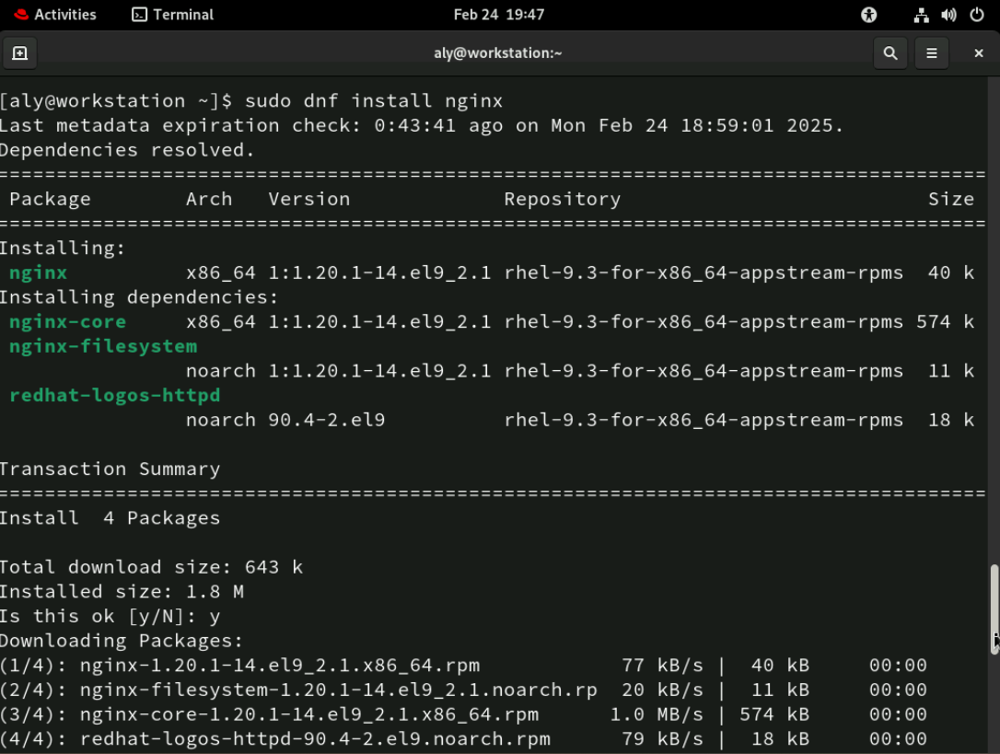
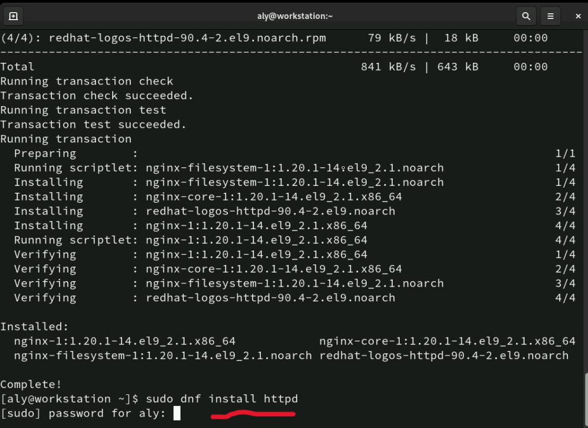

# Day 1


## Lab 1
- Create a group named `ivolve`:
  ```sh
  sudo groupadd ivolve
  ```

- Create a user `aly` with home directory, add to `ivolve` group, and set bash as the default shell:
  ```sh
  sudo useradd -m -G ivolve -s /bin/bash aly
  ```

- Set password for user `aly`:
  ```sh
  sudo passwd aly
  ```

- Edit sudoers file to allow `aly` to install nginx without a password:
  ```sh
  sudo visudo
  ```
  Add the following line:
  ```
  aly ALL=(ALL) NOPASSWD: /usr/bin/dnf install nginx
  ```
### ScreenShots for soloution 

- 

- 

------------------------------------------
## Lab 2
- Install mail service:
  ```sh
  dnf install s-nail -y
  ```

- Install Mail Transfer Agent:
  ```sh
  sudo dnf install postfix -y
  sudo systemctl enable --now postfix
  ```

- Write a script to monitor disk usage:
  ```sh
  #!/bin/bash

  THRESHOLD=10 

  EMAIL="aihe00@outlook.com"  

  USAGE=$(df / | awk 'NR==2 {print $5}' | sed 's/%//')

  if [ "$USAGE" -gt "$THRESHOLD" ]; then
      echo "Warning: Disk space usage on / has exceeded $THRESHOLD%. Current usage: $USAGE%." \
      | mail -s "Disk Space Alert" $EMAIL
  fi
  ```

- Make the script executable:
  ```sh
  chmod +x script.sh
  ```

- Configure scheduling with cron:
  ```sh
  crontab -e
  ```
  Add the following line to run the script at 5 PM every day:
  ```
  0 17 * * * /path/to/script.sh
  ```


